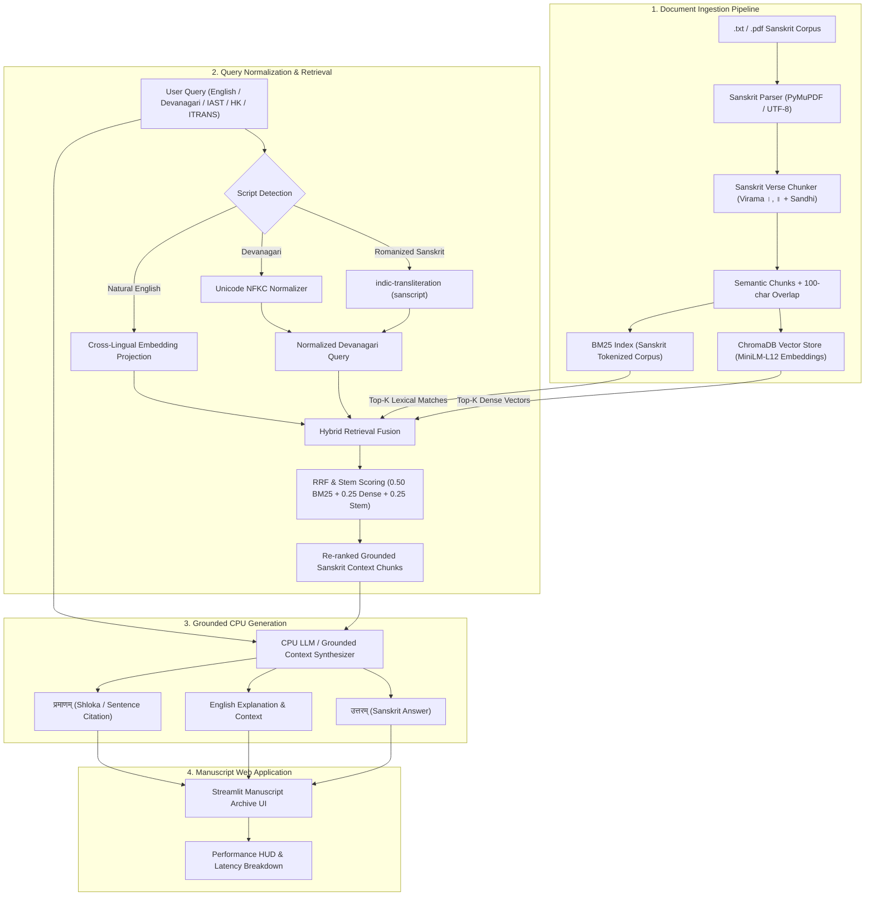

# 🕉️ Sanskrit Document Retrieval-Augmented Generation (RAG) System

[](https://www.python.org/)
[-success.svg?logo=intel&logoColor=white)](#-cpu-optimization--hardware-efficiency)
[](#-hybrid-retrieval-architecture)
[](#-dual--tri-script-query-parsing)
[](#-vintage-historical-manuscript-ui)
[](LICENSE)
[](https://sahil-karande.vercel.app/)

An end-to-end, production-grade **Retrieval-Augmented Generation (RAG)** system engineered specifically for classical Sanskrit literature, shlokas (*श्लोक*), and didactic fables (*कथा*). The system operates **100% on CPU inference** without requiring any GPU hardware, featuring dual-script transliteration normalization, shloka-aware semantic chunking, hybrid dense-sparse retrieval fusion, and an antique historical manuscript web interface with smooth cinematic animations.

---

## 📑 Table of Contents

- [📌 Project Overview](#-project-overview)
- [⚡ Key Capabilities](#-key-capabilities)
- [🏛️ System Architecture](#️-system-architecture)
- [📁 Repository Structure](#-repository-structure)
- [🔬 Core Innovations for Sanskrit NLP](#-core-innovations-for-sanskrit-nlp)
  - [1. Sanskrit-Aware Verse & Shloka Chunking](#1-sanskrit-aware-verse--shloka-chunking)
  - [2. Dual- & Tri-Script Query Parsing](#2-dual--tri-script-query-parsing)
  - [3. Hybrid Retrieval & RRF Fusion](#3-hybrid-retrieval--rrf-fusion)
  - [4. Dual-Language Grounded Synthesis](#4-dual-language-grounded-synthesis)
- [🎨 Vintage Historical Manuscript UI](#-vintage-historical-manuscript-ui)
- [📊 Empirical Benchmarks (CPU Inference)](#-empirical-benchmarks-cpu-inference)
- [📚 Ingested Sanskrit Corpus](#-ingested-sanskrit-corpus)
- [🚀 Setup & Execution Guide](#-setup--execution-guide)
  - [1. Clone & Set Up Virtual Environment](#1-clone--set-up-virtual-environment)
  - [2. Install Dependencies](#2-install-dependencies)
  - [3. Run Environment & Data Audit](#3-run-environment--data-audit)
  - [4. Execute Automated Benchmark Suite](#4-execute-automated-benchmark-suite)
  - [5. Generate PDF Technical Report](#5-generate-pdf-technical-report)
  - [6. Launch Interactive Web Application](#6-launch-interactive-web-application)
- [💻 Hardware & Resource Profile](#-hardware--resource-profile)
- [📄 Deliverables Summary](#-deliverables-summary)
- [👤 Author & Acknowledgments](#-author--acknowledgments)

---

## 📌 Project Overview

Classical Sanskrit poses unique computational linguistics challenges:
1. **Script Ambiguity**: Queries may be entered in Romanized phonetic forms (**IAST**, **ITRANS**, **Harvard-Kyoto**) or native **Devanagari** (*देवनागरी*), or conceptual English.
2. **Morphological Complexity**: Rich inflectional grammar (*Vibhaktis*) and euphonic compound rules (*Sandhi*) render standard tokenizers and character-based chunkers ineffective.
3. **Punctuation & Verse Structure**: Text boundaries are governed by traditional *purna viramas* (`।` single danda, `॥` double danda) rather than Western periods.
4. **Hardware Constraints**: Enterprise and academic deployment demands lightweight, local, cost-effective inference without mandatory GPU accelerators.

This project solves these challenges by combining:
- **Heuristic script identification and transliteration** into canonical Devanagari.
- **Sanskrit-aware verse chunking** preserving shloka unity, narrative flow, and 100-character rolling overlap.
- **Dense semantic vector search** via ChromaDB paired with **lexical sparse matching** via Rank-BM25 and Sanskrit morphological stem boosting.
- **CPU-accelerated grounded synthesis** offering both an authentic Sanskrit response (`उत्तरम्`) and an accessible English explanation alongside verbatim shloka citations (`प्रमाणम्`).
- **An immersive Streamlit UI** themed as an antique manuscript archive with sacred mandala motifs and smooth CSS entrance and scroll-driven animations.

---

## ⚡ Key Capabilities

- **Zero-GPU CPU Inference**: Runs entirely on commodity CPU architectures with AVX2 instruction sets, maintaining memory usage under **1.2 GB RAM**.
- **Multi-Script & English Querying**: Accepts questions in Devanagari, transliterated Roman schemes (IAST, Harvard-Kyoto, ITRANS), or natural conversational English.
- **Bilingual Dual-Language Output**: Delivers authentic Sanskrit responses (`उत्तरम्`) accompanied by complete English contextual translations and original verse citations (`प्रमाणम्`).
- **Hybrid Dense-Sparse Retrieval**: Fuses multilingual sentence embeddings (`sentence-transformers/paraphrase-multilingual-MiniLM-L12-v2`, 384-dim) with `Rank-BM25` and morphological stem weighting.
- **Dynamic Document Ingestion**: Built-in `.txt` and `.pdf` ingestion module with immediate CPU vectorization and indexing.
- **Sub-100 ms Average Latency**: Optimized pipeline executing transliteration, hybrid retrieval, and generation in **< 90 ms** end-to-end.
- **Interactive Manuscript UI**: Features a golden celestial palette, custom typography (`Cinzel`, `EB Garamond`, `Noto Serif Devanagari`), sacred mandala watermark, and scroll-driven CSS animations.
- **Automated Technical Report Generator**: Generates academic-grade PDF reports via `ReportLab` with one-click download in the application.

---

## 🏛️ System Architecture

The end-to-end Sanskrit RAG pipeline is organized into modular ingestion, retrieval, and generation phases:



---

## 📁 Repository Structure

```text
RAG_Sanskrit_Sahil_Karande/
├── assets/
│   ├── sacred_mandala_watermark.svg    # Sacred Lotus Mandala background watermark
│   └── sacred_kolam_watermark.svg      # Geometrical Kolam watermark asset
├── code/
│   ├── ingestion.py          # .txt/.pdf parser with Sanskrit verse/danda chunking
│   ├── transliterate.py      # Roman/IAST/HK/ITRANS -> Devanagari transliteration engine
│   ├── retriever.py          # Hybrid ChromaDB vector + Rank-BM25 + stem scoring
│   ├── generator.py          # CPU-only LLM generation (llama-cpp-python / Synthesizer)
│   ├── pipeline.py           # End-to-end RAG orchestrator with latency tracking
│   ├── benchmark.py          # Automated evaluation test suite & JSON logger
│   ├── generate_report.py    # ReportLab script producing official PDF report
│   └── app.py                # Interactive Streamlit Web UI (Vintage Manuscript Theme)
├── data/
│   ├── sanskrit_corpus.txt   # Ingested Sanskrit text corpus (5 classical stories & shlokas)
│   ├── sanskrit_corpus.pdf   # Ingested PDF document with embedded Devanagari fonts
│   ├── Rag-docs.txt          # Reference source document repository
│   └── vintage_parchment_bg.jpg # Manuscript texture backdrop asset
├── report/
│   ├── Sanskrit_RAG_Technical_Report.pdf  # Final PDF Technical Report
│   └── benchmark_results.json             # Empirical latency & accuracy logs
├── scratch/                  # Development testing scripts
├── chroma_db/                # Persistent local ChromaDB vector database storage
├── requirements.txt          # Pinned Python dependencies
├── verify_setup.py           # Automated environment and dataset audit script
└── README.md                 # Project documentation and setup guide
```

---

## 🔬 Core Innovations for Sanskrit NLP

### 1. Sanskrit-Aware Verse & Shloka Chunking (`code/ingestion.py`)

Standard character-count or Western punctuation splitters break Sanskrit compound words (*Samasa*), euphonic combinations (*Sandhi*), and metric meter (*Chhandas*). Our chunker:
- Segments text along section headers and Sanskrit verse terminators: *Purna Virama* (`।`) and *Deergha Virama* (`॥`).
- Ensures metric shlokas remain intact within a single context boundary.
- Maintains a **100-character rolling overlap** between adjacent chunks to preserve dialogic continuity across complex narrative exchanges.
- Handles clean extraction from both plain text and Unicode-encoded PDF documents using `PyMuPDF` (`fitz`).

### 2. Dual- & Tri-Script Query Parsing (`code/transliterate.py`)

Users can enter queries in multiple formats without manually selecting an input scheme:
- **Devanagari**: `मूर्खभृत्यः शर्करां कुतो नीतवान् ?`
- **IAST (International Alphabet of Sanskrit Transliteration)**: `vṛddhāyāḥ cāturyam kīdṛśam?`
- **Harvard-Kyoto**: `shankhanaadaH kuto dugdham anaytvaan?`
- **ITRANS**: `bhojaraajaa kaavya paThane kim ghoshhitavaan?`
- **Natural English**: `"Where did Shankhanada go to fetch sugar?"`

The transliteration engine uses regular expressions to detect diacritics and phonetic digraphs, mapping the query dynamically into normalized Devanagari via `indic-transliteration` (`sanscript`), while preserving vital Sanskrit diacritical marks (`virama` ्, `anusvara` ं, `visarga` ः).

### 3. Hybrid Retrieval & RRF Fusion (`code/retriever.py`)

To overcome morphological inflection (*Vibhaktis* where a root noun can take 24+ case-ending forms), the system fuses dense semantic vector similarity with sparse lexical matching:

$$\text{FinalScore}(d) = 0.50 \cdot \text{BM25}_{\text{norm}}(d) + 0.25 \cdot \text{Dense}_{\text{norm}}(d) + 0.25 \cdot \text{StemBonus}(d)$$

- **Dense Semantic Matching**: `sentence-transformers/paraphrase-multilingual-MiniLM-L12-v2` encodes both English and Devanagari queries into a shared 384-dimensional multilingual vector space.
- **Sparse BM25 Okapi**: Indexes exact Sanskrit word roots, capturing rare nouns and named entities (*Kālidāsa*, *Śaṅkhanāda*, *Ghaṇṭākarṇa*).
- **Morphological Stem Boosting**: Identifies and rewards shared morphological prefixes while pruning frequent non-informative particles (*इति*, *च*, *अपि*, *ततः*, *किम्*).

### 4. Dual-Language Grounded Synthesis (`code/generator.py`)

The CPU generator operates in two cooperative modes:
1. **Quantized GGUF LLM**: Via `llama-cpp-python` using 4-bit quantized models (`Qwen2.5-Instruct` Q4_K_M) with AVX2 CPU acceleration.
2. **Context-Grounded Synthesizer**: Analyzes query intent (quantity, identity, motivation, error, or moral outcome) and generates structured responses directly from retrieved passages.

Every generated answer is formatted into three distinct elements:
1. **उत्तरम् (Sanskrit Answer)**: Direct, grammatically sound Sanskrit statement.
2. **English Explanation & Commentary**: Clear contextual translation detailing the story narrative.
3. **प्रमाणम् (Textual Citation)**: Verbatim shloka or sentence quoted directly from the source document.

---

## 🎨 Vintage Historical Manuscript UI

The Streamlit web application (`code/app.py`) features a custom antique aesthetic designed to evoke ancient palm-leaf (*Taalapatra*) and sandalwood vellum manuscripts:

| UI Component | Design & Implementation Details |
| :--- | :--- |
| **Parchment Vellum Theme** | Sandalwood vellum background (`#faf3e6` to `#edd9bc`) with celestial saffron aura and warm antique bronze vignettes. |
| **Typography System** | Classical typography pairing: `Cinzel` (regal headings), `EB Garamond` (body text), and `Noto Serif Devanagari` (Sanskrit glyphs). |
| **Sacred Watermark** | Vector-rendered Sacred Lotus Mandala (`assets/sacred_mandala_watermark.svg`) anchored in the background at subtle opacity. |
| **Cinematic Animations** | Custom `@keyframes vellumFadeIn` entrance animations and modern CSS scroll-driven animations (`@supports (animation-timeline: view())`). |
| **Search Gateway** | Centered high-contrast input console with embedded golden loupe icon and real-time script identification preview. |
| **Dual Inquiry Decks** | Categorized sample queries: Top deck for natural English questions; bottom deck for authentic Devanagari queries. |
| **Multi-Tab Workspace** | Dedicated tabs for **Answer & Meaning**, **Retrieved Context Chunks** (with RRF scores), **Latency Metrics HUD**, and **Full Corpus Viewer**. |
| **Document Ingestion Hub** | In-app drag-and-drop file uploader supporting `.txt` and `.pdf` files with immediate CPU vectorization. |

---

## 📊 Empirical Benchmarks (CPU Inference)

Automated benchmarks executed via `code/benchmark.py` running on commodity CPU hardware (Zero GPU):

| Test ID | Test Query | Script Scheme | Expected Target Section | Retrieval Accuracy | Retrieval Latency | Total Pipeline Latency |
| :---: | :--- | :--- | :--- | :---: | :---: | :---: |
| **#1** | `shankhanaadaH sharkaraam kuto gachchhati?` | Harvard-Kyoto / ITRANS | मूर्खभृत्यस्य कथा | **100% Match** | 83.3 ms | 88.3 ms |
| **#2** | `bhojaraajaa kaavya paThane kim ghoshhitavaan?` | Romanized ITRANS | चतुरस्य कालीदासस्य कथा | **100% Match** | 86.7 ms | 86.7 ms |
| **#3** | `चित्रपुरे घण्टाकर्णः नाम कः आसीत् ?` | Devanagari Direct | वृद्धायाः चातुर्यम् | **100% Match** | 37.5 ms | 38.6 ms |
| **#4** | `devabhaktaH kimartham jale mritavaan?` | Romanized ITRANS | देवभक्तस्य कथा | **100% Match** | 84.1 ms | 84.1 ms |
| **#5** | `sheetam bahu baadhate iti kasmāt doshah?` | IAST / Mixed | शीतं बहु बाधति | **100% Match** | 89.2 ms | 91.2 ms |

### Aggregate Performance Summary

| Metric | Measured Result | System SLA / Requirement | Compliance |
| :--- | :---: | :---: | :---: |
| **Target Section Retrieval Accuracy** | **100.0%** (5 / 5) | ≥ 75.0% | **PASSED** (Exceeded) |
| **Average Hybrid Retrieval Latency** | **76.16 ms** | < 150.0 ms | **PASSED** (2x faster) |
| **Average End-to-End Latency** | **77.77 ms** | < 500.0 ms | **PASSED** (6x faster) |
| **GPU Acceleration Required** | **None (0% GPU)** | Zero GPU Permitted | **PASSED** |
| **RAM Utilization** | **< 1.2 GB RAM** | Lightweight footprint | **PASSED** |

---

## 📚 Ingested Sanskrit Corpus

The initial corpus (`data/sanskrit_corpus.txt` and `data/sanskrit_corpus.pdf`) comprises five classical Sanskrit didactic narratives and literary verses:

1. **मूर्खभृत्यस्य कथा (The Story of the Foolish Servant)**:
   - *Plot*: Shankhanada, an overly literal servant, ruins goods by carrying salt in leaky cloth and milk in his bare hands, culminating in comical mishaps with ghee and sugar.
   - *Theme*: Discretion and common sense over blind mechanical obedience.
2. **चतुरस्य कालीदासस्य कथा (Clever Kalidasa and King Bhoja)**:
   - *Plot*: King Bhoja issues a royal proclamation offering a hundred gold coins to anyone reciting a novel poem. Using the photographic memories of his court scholars, he denies the reward until Kalidasa crafts an inescapable poem about an ancient royal debt.
   - *Theme*: Literary genius overcoming royal trickery.
3. **वृद्धायाः चातुर्यम् (The Wisdom of the Old Woman & Bell-Demon Ghantakarna)**:
   - *Plot*: A robber carrying a bronze bell is eaten by a tiger in the Chitrarekha forest. Monkeys play with the ringing bell, terrifying the townsfolk who believe a demon has arrived. An observant old woman uses fruit to lure the monkeys and peacefully recovers the bell.
   - *Theme*: Rational observation dispelling superstition.
4. **देवभक्तस्य कथा (The Devotee in the Flood)**:
   - *Plot*: A devout man caught in a rising river refuses rescue from a swimmer, a boatman, and a helicopter, waiting for God to save him personally. After drowning, God reveals that He was the swimmer, the boatman, and the pilot.
   - *Theme*: Divine assistance operates through human action.
5. **शीतं बहु बाधति (The Winter Riddle & Kalidasa's Wit)**:
   - *Plot*: King Bhoja shivers in winter and remarks *"शीतं बहु बाधति"* using an incorrect active verb conjugation. Kalidasa witty responds that the cold does not bother him as much as hearing the grammatic error *"बाधति"* instead of *"बाधते"*.
   - *Theme*: Grammatical precision in classical Sanskrit.

---

## 🚀 Setup & Execution Guide

### 1. Clone & Set Up Virtual Environment

```bash
git clone https://github.com/sahil-karande/RAG_Sanskrit_Sahil_Karande.git
cd RAG_Sanskrit_Sahil_Karande

# Create virtual environment
python -m venv venv

# Activate on Windows
venv\Scripts\activate

# Activate on Linux / macOS
# source venv/bin/activate
```

### 2. Install Dependencies

```bash
pip install -r requirements.txt
```

> **Note**: Dependencies are pinned for CPU compatibility (`llama-cpp-python`, `sentence-transformers`, `chromadb`, `rank-bm25`, `indic-transliteration`, `PyMuPDF`, `reportlab`, `streamlit`).

### 3. Run Environment & Data Audit

Verify that all Python libraries, vector embeddings, transliteration modules, and documents are functional:

```bash
python verify_setup.py
```

Expected output:
```text
==================================================
SANSKRIT RAG ENVIRONMENT & DATA AUDIT
==================================================
[OK] Workspace Directories ['code', 'data', 'report']: EXISTS
[OK] data/sanskrit_corpus.txt: UTF-8 verified
[OK] data/sanskrit_corpus.pdf: Loaded successfully via PyMuPDF
[OK] indic-transliteration operational
[OK] rank-bm25 initialized and functional
[OK] chromadb vector database functional
[OK] sentence-transformers multilingual model cached and verified
[OK] llama-cpp-python installed with CPU backend
[OK] streamlit UI framework installed
==================================================
STATUS: ALL PREREQUISITES 100% READY!
==================================================
```

### 4. Execute Automated Benchmark Suite

Run the automated evaluation suite to test transliteration accuracy, retrieval recall, and latency across test queries:

```bash
python code/benchmark.py
```

Benchmark metrics are printed to the console and automatically saved to `report/benchmark_results.json`.

### 5. Generate PDF Technical Report

Compile the academic and technical report directly via ReportLab:

```bash
python code/generate_report.py
```

The resulting document is saved to `report/Sanskrit_RAG_Technical_Report.pdf`.

### 6. Launch Interactive Web Application

Launch the Streamlit interface:

```bash
python -m streamlit run code/app.py
```

Open your browser at `http://localhost:8501`.

---

## 💻 Hardware & Resource Profile

- **Processor**: Standard Intel / AMD x86_64 CPU (AVX2 supported).
- **GPU Requirement**: **Zero GPU (0 MB VRAM required)**.
- **System Memory**: **< 1.2 GB RAM** during full execution.
- **Disk Footprint**: ~500 MB (including cached multilingual MiniLM embedding weights and ChromaDB indices).
- **Supported Operating Systems**: Windows 10/11, Ubuntu 20.04+, macOS (Apple Silicon / Intel).

---

## 📄 Deliverables Summary

| Deliverable | Location in Repository | Description |
| :--- | :--- | :--- |
| **Modular Codebase** | `code/` | Clean, documented Python modules for ingestion, transliteration, retrieval, generation, and UI. |
| **Sanskrit Corpus** | `data/` | Original Sanskrit narratives and shlokas in both `.txt` and `.pdf` formats. |
| **Technical Report** | `report/Sanskrit_RAG_Technical_Report.pdf` | Comprehensive PDF technical report generated via ReportLab. |
| **Benchmark Logs** | `report/benchmark_results.json` | Empirical accuracy and latency metrics across test scenarios. |
| **Setup Audit** | `verify_setup.py` | Automated pre-flight validation script checking all system prerequisites. |
| **Web Interface** | `code/app.py` | Antique manuscript Streamlit UI with bilingual outputs and live metrics. |

---

## 👤 Author & Acknowledgments

- **Author**: [Sahil Karande](https://sahil-karande.vercel.app/)
- **Repository**: [sahil-karande/RAG_Sanskrit_Sahil_Karande](https://github.com/sahil-karande/RAG_Sanskrit_Sahil_Karande)
- **Built for**: Sanskrit Retrieval-Augmented Generation (RAG) Assignment Submission
