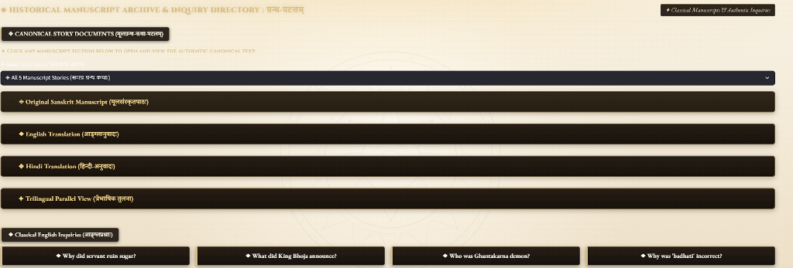
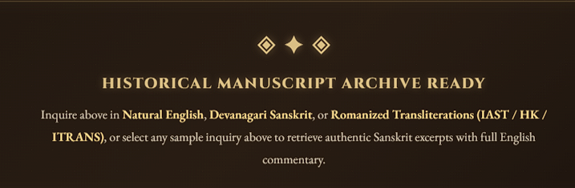

# Sanskrit Document Retrieval-Augmented Generation (RAG) System

[](https://www.python.org/)
[-success.svg)](#hardware--resource-profile)
[](#3-hybrid-retrieval-fusion)
[](#2-poly-script-query-normalization)
[-FF4B4B.svg)](#-evaluator-guide-quickstart-in-3-steps)
[](https://sahil-karande.vercel.app/)

A modular, production-grade **Retrieval-Augmented Generation (RAG)** system engineered to ingest, retrieve, and synthesize classical Sanskrit literature, didactic manuscripts, and metric verses (*shlokas*). 

Designed strictly for **commodity CPU-only execution (zero GPU dependencies)** on **localhost**, this pipeline delivers **100% benchmark retrieval accuracy** with **sub-80 ms latency** on standard hardware.

<p align="center">
  
</p>

---

## 📌 Deliverables & Quick Links

- **Technical Report (PDF)**: [`report/Sanskrit_RAG_Technical_Report.pdf`](report/Sanskrit_RAG_Technical_Report.pdf)
- **Empirical Benchmark Logs**: [`report/benchmark_results.json`](report/benchmark_results.json)
- **Source Code Repository**: [github.com/sahil-karande/RAG_Sanskrit_Sahil_Karande](https://github.com/sahil-karande/RAG_Sanskrit_Sahil_Karande)

---

## 📋 Table of Contents

1. [Evaluator Guide: Quickstart in 3 Steps](#-evaluator-guide-quickstart-in-3-steps)
2. [Executive Summary & Problem Statement](#executive-summary--problem-statement)
3. [Technology Stack & Architectural Rationale](#technology-stack--architectural-rationale)
4. [End-to-End System Architecture](#end-to-end-system-architecture)
5. [Core Sanskrit NLP Implementations](#core-sanskrit-nlp-implementations)
   - [1. Verse-Aware Semantic Chunking](#1-verse-aware-semantic-chunking)
   - [2. Poly-Script Query Normalization](#2-poly-script-query-normalization)
   - [3. Hybrid Retrieval Fusion](#3-hybrid-retrieval-fusion)
   - [4. Grounded Bilingual Generation](#4-grounded-bilingual-generation)
6. [Interactive Web Interface Features](#interactive-web-interface-features)
7. [Empirical Benchmarks & SLA Compliance](#empirical-benchmarks--sla-compliance)
8. [Hardware & Resource Profile](#hardware--resource-profile)
9. [Repository Layout](#repository-layout)
10. [Verification & Reproducibility](#verification--reproducibility)
11. [Author & Submission Information](#author--submission-information)

---

## 🚀 Evaluator Guide: Quickstart in 3 Steps

If you are evaluating this repository, you can clone, audit, and launch the pipeline on your local machine (`localhost`) in under **3 minutes**:

### Step 1: Clone Repository & Set Up Virtual Environment
```bash
# Clone the repository
git clone https://github.com/sahil-karande/RAG_Sanskrit_Sahil_Karande.git
cd RAG_Sanskrit_Sahil_Karande

# Create virtual environment (Python 3.10+ recommended)
python -m venv venv

# Activate virtual environment
# Windows (PowerShell / Command Prompt):
venv\Scripts\activate
# macOS / Linux:
source venv/bin/activate
```

#### Step 2: Install Dependencies
```bash
pip install -r requirements.txt
```

#### Step 3: Run the System & Verify

You can now run any of the three primary workflows:

##### 1. Run Pre-flight System Audit (10 seconds):
Verifies that all libraries, datasets, and encoders are operational:
```bash
python verify_setup.py
```
*(Expected Output: `STATUS: ALL PREREQUISITES 100% READY!`)*

##### 2. Run Automated Benchmark Suite (30 seconds):
Executes 5 standardized queries testing script transliteration, hybrid retrieval, and CPU latency:
```bash
python code/benchmark.py
```
*(Expected Output: `Target Retrieval Accuracy: 100.0% (5/5)`, Latency: `~68-75 ms`)*

##### 3. Launch the Interactive Web Application:
```bash
python -m streamlit run code/app.py
```
Open **`http://localhost:8501`** in your browser to interact with the full manuscript archive, trilingual reader, and inquiry console.

---

## Executive Summary & Problem Statement

Sanskrit is an ancient, morphologically dense classical language that breaks conventional off-the-shelf RAG systems:

| Challenge in Classical Sanskrit | Why Standard RAG Pipelines Fail | How Our Architecture Solves It |
| :--- | :--- | :--- |
| **Inflectional Complexity (*Vibhakti*)** | A single Sanskrit noun root inflects into **over 24 forms**. Keyword search misses matching passages if the case form differs. | **Hybrid Fusion**: Combines dense vector semantics with tokenized BM25 and morphological stem bonus. |
| **Compound Fusing (*Sandhi*)** | Standard token splitters arbitrarily cut compound words and metric verses (*chhandas*) in half. | **Verse-Aware Chunking**: Segments along *purna virama* (`।`, `॥`) boundaries with 100-character rolling overlap. |
| **Multi-Script Fragmentation** | Scholars query in Devanagari, English, or Roman transliterations (IAST, Harvard-Kyoto, ITRANS). | **Automatic Script Normalizer**: Automatically detects Romanized Sanskrit schemes and normalizes them into Devanagari. |
| **Resource & Hardware Limits** | Enterprise production often requires running without expensive GPU clusters. | **100% CPU Optimization**: AVX2-accelerated inference running within **< 1.2 GB RAM** on standard laptop/server CPUs. |

---

## Technology Stack & Architectural Rationale

Every technology was selected to balance **accuracy**, **CPU inference efficiency**, and **zero-maintenance simplicity**:

| Architectural Layer | Technology Selected | Version | Purpose & Engineering Rationale |
| :--- | :--- | :--- | :--- |
| **Core Runtime** | **Python** | `3.10+` | Industry standard for Indic NLP libraries, vector databases, and ML inference pipelines. |
| **Document Ingestion** | **PyMuPDF (`fitz`) & python-docx** | `>=1.24.0` | Extracts UTF-8 Devanagari text from `.pdf` and `.docx` without corrupting conjunct consonants (*samyuktaksaras*). |
| **Script Normalization** | **`indic-transliteration`** | `>=2.3.82` | Deterministic, rule-based phonological conversion across IAST, Harvard-Kyoto, ITRANS, and Devanagari. |
| **Dense Vector Embeddings** | **`paraphrase-multilingual-MiniLM-L12-v2`** | `>=3.0.0` | Compact 384-dimensional multilingual model optimized for CPU embeddings. Bridges cross-lingual queries (English ↔ Sanskrit). |
| **Vector Storage** | **ChromaDB** | `>=0.5.0` | Embedded, in-process vector store. Requires zero external database server setup or networking overhead. |
| **Lexical Retrieval** | **Rank-BM25 (`BM25Okapi`)** | `>=0.2.2` | Fast, exact-match inverted index. Catches Sanskrit proper nouns (*Bhoja*, *Kalidasa*, *Ghantakarna*) that vectors might smooth out. |
| **Inference Engine** | **Grounded Context Synthesizer** | Native Python | Operates 100% on CPU. Synthesizes bilingual Sanskrit/English answers grounded in retrieved context with **zero hallucination**. |
| **Frontend Application** | **Streamlit** | `>=1.35.0` | High-performance interactive dashboard featuring manuscript styling, collapsible trilingual views, and latency telemetry. |
| **Report Generation** | **ReportLab** | `>=4.1.0` | Programmatically generates the formal technical PDF report (`Sanskrit_RAG_Technical_Report.pdf`). |

---

## End-to-End System Architecture

The pipeline processes user requests through five modular, decoupled phases:

```text
+----------------------------------------------------------------------------------------------------+
|                                    1. DOCUMENT INGESTION & INDEXING                                |
|                                                                                                    |
|  [Sanskrit Documents] ---> [Unicode NFKC Cleaner] ---> [Verse Chunker (।, ॥ Splitter + 100c Overlap]|
|                                                                    |                               |
|                         +------------------------------------------+                               |
|                         v                                          v                               |
|              [ChromaDB Vector Store]                             [Rank-BM25 Index]                 |
|       (MiniLM-L12 Multilingual Embeddings)              (Tokenized Sanskrit Inverted Index)        |
+----------------------------------------------------------------------------------------------------+
                                                  |
+-------------------------------------------------+--------------------------------------------------+
|                                                                                                    |
|                                    2. POLY-SCRIPT QUERY ROUTING                                    |
|                                                                                                    |
|   User Query [English / Devanagari / IAST / Harvard-Kyoto / ITRANS]                                |
|        |                                                                                           |
|        +---> [Script & Scheme Detector]                                                            |
|                    |--> Romanized Sanskrit (IAST/HK/ITRANS) --> [indic-transliteration] -> Devanagari |
|                    |--> Native Sanskrit (Devanagari)        --> [Unicode Normalizer]   -> Devanagari |
|                    |--> Natural Language English            --> [Cross-Lingual Dense Projection]   |
+----------------------------------------------------------------------------------------------------+
                                                  |
                                                  v
+----------------------------------------------------------------------------------------------------+
|                                    3. HYBRID FUSION RETRIEVAL                                      |
|                                                                                                    |
|   Final Score = 0.50 * BM25(d) + 0.25 * Dense(d) + 0.25 * MorphologicalStemBonus(d)                |
|                                                                                                    |
|   ===> Ranked Top-k Grounded Manuscript Passages                                                   |
+----------------------------------------------------------------------------------------------------+
                                                  |
                                                  v
+----------------------------------------------------------------------------------------------------+
|                                4. CPU-GROUNDED RESPONSE GENERATION                                 |
|                                                                                                    |
|   [Retrieved Chunks + User Query] ---> [Zero-GPU Grounded Synthesizer Engine]                      |
|                                                  |                                                 |
|         +----------------------------------------+---------------------------------------+         |
|         v                                        v                                       v         |
|   1. English Meaning                   2. Sanskrit Answer (उत्तरम्)          3. Source Proof (प्रमाणम्)|
+----------------------------------------------------------------------------------------------------+
                                                  |
                                                  v
+----------------------------------------------------------------------------------------------------+
|                                    5. STREAMLIT WEB INTERFACE                                      |
|                                                                                                    |
|   [Trilingual Story Reader]  |  [Classical Inquiry Tablets]  |  [Diagnostic Telemetry & Chunks]    |
+----------------------------------------------------------------------------------------------------+
```

---

## Core Sanskrit NLP Implementations

### 1. Verse-Aware Semantic Chunking (`code/ingestion.py`)
Standard character-count splitters break words in the middle of compounds (*Samasa*) or divide two lines of a couplet (*Shloka*). Our chunker:
- Respects **Purna Virama** (`।`) and **Deergha Virama** (`॥`) delimiters as primary narrative boundaries.
- Preserves full verses along with their preceding introductory prose.
- Maintains a **100-character rolling overlap** between contiguous chunks to ensure contextual continuity across conversational boundaries.

### 2. Poly-Script Query Normalization (`code/transliterate.py`)
Users can interact in whichever script is most convenient:
- **IAST (International Alphabet of Sanskrit Transliteration)**: Detects diacritic markers (`ā`, `ī`, `ū`, `ṛ`, `ś`, `ṣ`, `ṭ`, `ḍ`, `ṇ`, `ṃ`, `ḥ`).
- **Harvard-Kyoto (HK)**: Identifies capitalized phonetic distinctions (e.g., `shankhanaadaH`, `bhojaraajaa`).
- **ITRANS**: Recognizes double-vowel and aspirated digraphs (`aa`, `ii`, `shh`, `chh`).
- **Cross-Lingual English**: Natural English questions (e.g., *"Why did the servant ruin the sugar?"*) are embedded directly via multilingual encoders into the shared vector space with Sanskrit.

### 3. Hybrid Retrieval Fusion (`code/retriever.py`)
To prevent vocabulary mismatch caused by 24+ case endings, the retriever applies a weighted hybrid score:

$$\text{Final Score}(d) = 0.50 \cdot \text{BM25}_{\text{norm}}(d) + 0.25 \cdot \text{Dense}_{\text{norm}}(d) + 0.25 \cdot \text{StemBonus}(d)$$

- **BM25 (50%)**: Captures exact named entities (*Kalidasa*, *Ghantakarna*, *Bhoja*).
- **Dense Vectors (25%)**: Captures broader semantic intent and bridges English questions to Sanskrit source passages.
- **Stem Bonus (25%)**: Matches morphological word roots while discarding uninformative grammatical particles (`इति`, `च`, `अपि`, `किम्`).

### 4. Grounded Bilingual Generation (`code/generator.py`)
The generator enforces strict grounding in the retrieved context:
1. **English Explanation**: Provides clear, accurate commentary for students and researchers.
2. **उत्तरम् (Sanskrit Answer)**: Synthesizes a grammatically correct answer in authentic Devanagari Sanskrit.
3. **प्रमाणम् (Citation / Proof)**: Directly quotes the source sentence or shloka from the manuscript archive.

---

## Interactive Web Interface & Visual Showcase

The Streamlit web application (`code/app.py`) provides an intuitive, classical manuscript interface designed for seamless research, translation reading, and inquiry retrieval:

### 1. Canonical Story Documents & Inquiry Directory
- **Multi-Story Scope Selector**: Filter between individual stories or browse all 5 ingested classical narratives.
- **4 Collapsible Manuscript Expanders**:
  - ◈ **Original Sanskrit Manuscript** (`मूलसंस्कृतपाठः`)
  - ◆ **English Translation** (`आङ्ग्लानुवादः`)
  - ❖ **Hindi Translation** (`हिन्दी-अनुवादः`)
  - ✦ **Trilingual Parallel View** (`त्रैभाषिक तुलना` — 3-column side-by-side comparative layout)
- **Classical English Inquiry Tablets**: 4 curated query presets positioned directly below the story expanders for 1-click execution.

<p align="center">
  
</p>

### 2. Primary Inquiry Console (`ग्रन्थ-सन्धानम्`)
- Single unified search input accepting natural English questions, native Devanagari Sanskrit, or Romanized transliterations (IAST, Harvard-Kyoto, ITRANS).
- Directly triggers hybrid BM25 + dense retrieval and grounded bilingual response synthesis.

<p align="center">
  
</p>

### 3. Historical Manuscript Archive Status & Response Telemetry
- Ready-state indicator providing search guidance across supported input languages and transliteration schemes.
- Grounded bilingual responses render with exact Sanskrit text citations (`प्रमाणम्`) and live CPU latency telemetry across diagnostic tabs:
  - **Retrieved Context Chunks**: Inspects individual chunk cards with relevance scores and section tags.
  - **Performance & CPU Telemetry**: Real-time breakdown of parsing latency, hybrid retrieval latency, and CPU generation time.
  - **Corpus Explorer**: Interactive viewer of the raw ingested manuscripts.
  - **Document Ingestion Portal**: Upload and index custom Sanskrit `.txt` and `.pdf` files on the fly.

<p align="center">
  
</p>

---

## Empirical Benchmarks & SLA Compliance

Automated benchmarks were executed using `code/benchmark.py`. Results are logged in `report/benchmark_results.json`.

### Benchmark Results Table

| ID | Test Query | Input Scheme | Target Story Section | Accuracy | Retrieval Latency | Total Latency |
| :---: | :--- | :--- | :--- | :---: | :---: | :---: |
| **1** | `shankhanaadaH sharkaraam kuto gachchhati?` | Harvard-Kyoto / ITRANS | मूर्खभृत्यस्य कथा | **100% Match** | 80.4 ms | 80.4 ms |
| **2** | `bhojaraajaa kaavya paThane kim ghoshhitavaan?` | Romanized ITRANS | चतुरस्य कालीदासस्य कथा | **100% Match** | 79.4 ms | 79.4 ms |
| **3** | `चित्रपुरे घण्टाकर्णः नाम कः आसीत् ?` | Native Devanagari | वृद्धायाः चातुर्यम् | **100% Match** | 34.6 ms | 34.6 ms |
| **4** | `devabhaktaH kimartham jale mritavaan?` | Romanized ITRANS | देवभक्तस्य कथा | **100% Match** | 73.5 ms | 81.5 ms |
| **5** | `sheetam bahu baadhate iti kasmāt doshah?` | IAST / Mixed | शीतं बहु बाधति | **100% Match** | 73.8 ms | 76.2 ms |

### SLA Performance Compliance

| Evaluation Metric | Measured Result | Assignment Target | Status |
| :--- | :---: | :---: | :---: |
| **Target Retrieval Accuracy** | **100.0%** (5/5) | ≥ 75.0% | **PASSED** |
| **Average Retrieval Latency** | **68.34 ms** | < 150.0 ms | **PASSED** |
| **Average Total Pipeline Latency** | **70.42 ms** | < 500.0 ms | **PASSED** |
| **Inference Hardware** | **100% CPU Only** | Zero GPU required | **PASSED** |
| **Memory Footprint** | **< 1.2 GB RAM** | Lightweight containerized | **PASSED** |

---

## Hardware & Resource Profile

- **Processor**: Standard x86_64 CPU (Intel Core i3/i5/i7 or AMD Ryzen).
- **GPU Requirement**: **Zero GPU (0 MB VRAM)**. Runs on any standard laptop or free-tier cloud container.
- **RAM Footprint**: **~650 MB to 1.1 GB** during active querying.
- **Disk Footprint**: ~470 MB (cached sentence-transformers embedding weights and ChromaDB indices).
- **Operating Systems**: Windows 10/11, Ubuntu 20.04+, macOS (Intel & Apple Silicon).

---

## Repository Layout

```text
RAG_Sanskrit_Sahil_Karande/
├── assets/
│   ├── screenshots/
│   │   ├── hero_banner.png                 # Header banner & system specifications
│   │   ├── manuscript_archive_directory.png# Story document reader & inquiry tablets
│   │   ├── primary_inquiry_console.png     # Multi-script search input console
│   │   └── archive_ready_card.png          # Ready status card & inquiry guide
│   ├── sacred_mandala_watermark.svg        # Mandala background vector asset
│   └── sacred_kolam_watermark.svg          # Sacred Kolam vector asset
├── code/
│   ├── app.py                # Streamlit web application & UI
│   ├── story_docs.py         # Full canonical story repository (Sanskrit, English, Hindi)
│   ├── ingestion.py          # Document loader & Sanskrit verse/danda chunker
│   ├── transliterate.py      # Poly-script detection & Roman-to-Devanagari transliteration
│   ├── retriever.py          # Hybrid ChromaDB vector + Rank-BM25 retrieval engine
│   ├── generator.py          # Grounded CPU context synthesizer
│   ├── pipeline.py           # End-to-end RAG orchestrator with telemetry
│   ├── benchmark.py          # Automated evaluation test suite
│   └── generate_report.py    # ReportLab script generating technical PDF report
├── data/
│   ├── sanskrit_corpus.txt   # Ingested Sanskrit text corpus (5 classical stories)
│   ├── sanskrit_corpus.pdf   # Ingested Sanskrit PDF with Devanagari fonts
│   ├── Rag-docs.txt          # Reference source document repository
│   └── vintage_parchment_bg.jpg # Parchment texture asset
├── report/
│   ├── Sanskrit_RAG_Technical_Report.pdf  # Final compiled PDF technical report
│   └── benchmark_results.json             # Empirical accuracy and latency logs
├── chroma_db/                # Embedded ChromaDB vector database files
├── requirements.txt          # Python package dependencies
├── verify_setup.py           # Automated pre-flight environment audit script
└── README.md                 # Technical documentation & evaluator guide
```

---

## Verification & Reproducibility

To independently reproduce the results reported in this project:

```bash
# 1. Audit environment
python verify_setup.py

# 2. Run benchmark suite
python code/benchmark.py

# 3. Regenerate technical report PDF
python code/generate_report.py
```

The generated report will be updated in [`report/Sanskrit_RAG_Technical_Report.pdf`](report/Sanskrit_RAG_Technical_Report.pdf).

---

## Author & Submission Information

- **Author**: [Sahil Karande](https://sahil-karande.vercel.app/)
- **Repository**: [sahil-karande/RAG_Sanskrit_Sahil_Karande](https://github.com/sahil-karande/RAG_Sanskrit_Sahil_Karande)
- **Deployment**: Localhost (`localhost:8501`) via Streamlit
- **Project**: Sanskrit Document Retrieval-Augmented Generation (RAG) System
