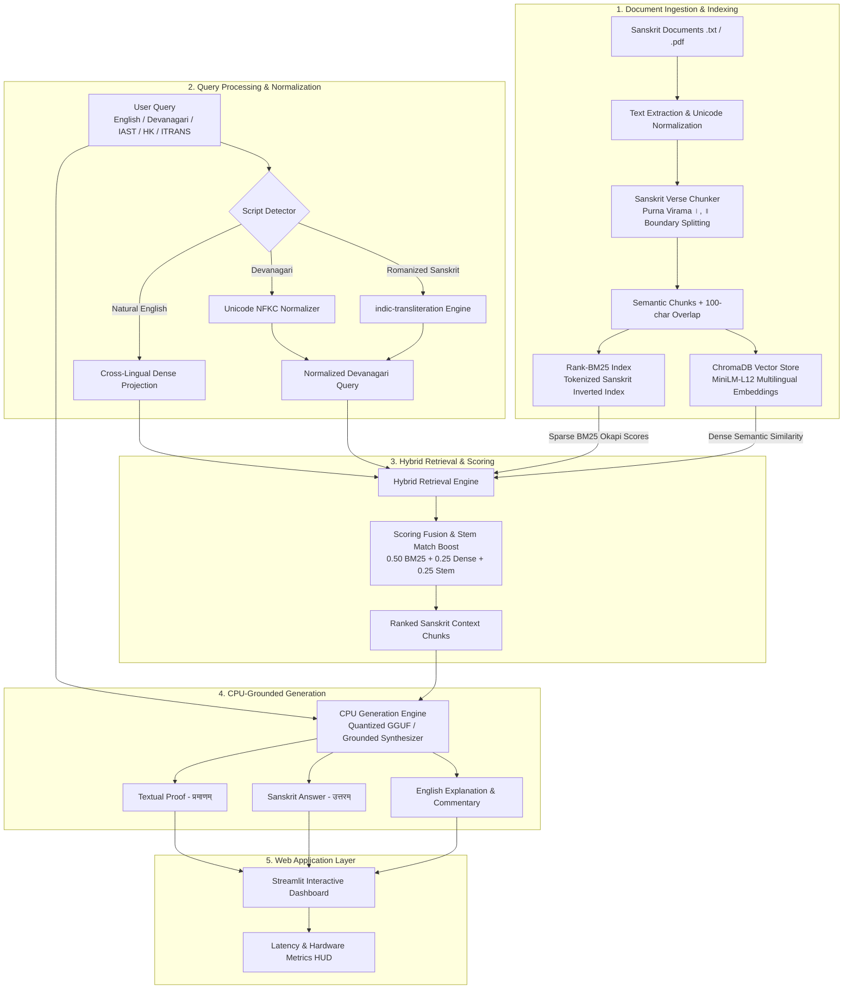

# Sanskrit Document Retrieval-Augmented Generation (RAG)

[](https://www.python.org/)
[-success.svg)](#hardware--resource-profile)
[](#hybrid-retrieval-mechanism)
[](#dual--tri-script-query-normalization)
[](https://streamlit.io/)
[](https://sahil-karande.vercel.app/)

A modular, production-ready **Retrieval-Augmented Generation (RAG)** pipeline developed for querying and synthesizing classical Sanskrit literature, didactic narratives, and shlokas. 

Engineered strictly for **commodity CPU-only execution (zero GPU dependencies)**, the system addresses core Sanskrit NLP challenges including verse-preserving segmentation, poly-script transliteration normalization, inflection-tolerant hybrid retrieval, and grounded bilingual output generation.

---

## Table of Contents

- [Project Overview](#project-overview)
- [Key Features](#key-features)
- [System Architecture](#system-architecture)
- [Technology Stack & Rationale](#technology-stack--rationale)
- [Sanskrit NLP Implementation Details](#sanskrit-nlp-implementation-details)
  - [1. Verse-Aware Chunking](#1-verse-aware-chunking)
  - [2. Dual- & Tri-Script Query Normalization](#2-dual--tri-script-query-normalization)
  - [3. Hybrid Retrieval Mechanism](#3-hybrid-retrieval-mechanism)
  - [4. Grounded Dual-Language Generation](#4-grounded-dual-language-generation)
- [Empirical Benchmarks & SLA Compliance](#empirical-benchmarks--sla-compliance)
- [Repository Structure](#repository-structure)
- [Installation & Quickstart](#installation--quickstart)
  - [Step 1: Environment Setup](#step-1-environment-setup)
  - [Step 2: Install Dependencies](#step-2-install-dependencies)
  - [Step 3: Run Verification Audit](#step-3-run-verification-audit)
  - [Step 4: Execute Automated Benchmarks](#step-4-execute-automated-benchmarks)
  - [Step 5: Generate PDF Technical Report](#step-5-generate-pdf-technical-report)
  - [Step 6: Launch Web Application](#step-6-launch-web-application)
- [Hardware & Resource Profile](#hardware--resource-profile)
- [Engineering Trade-offs & Production Considerations](#engineering-trade-offs--production-considerations)
- [Deliverables Checklist](#deliverables-checklist)
- [Author Information](#author-information)

---

## Project Overview

Sanskrit presents distinct natural language processing challenges that standard off-the-shelf RAG pipelines fail to handle:

1. **Morphological Richness (*Vibhakti*)**: Sanskrit is highly inflected. A single noun root can yield over 24 distinct declensional forms. Pure keyword search misses inflectional variants, while naive semantic embeddings often overlook rare entity tokens.
2. **Compound Words & Sandhi**: Words fuse phonetically across word boundaries. Fixed-token chunkers arbitrarily sever compound words (*Samasa*) and metric verses (*Chhandas*).
3. **Punctuation Standards**: Classical boundaries rely on *purna virama* (`।`) and *deergha virama* (`॥`) rather than Western periods.
4. **Script Disparity**: Academic and technical users query across multiple formats: Devanagari, Romanized phonetics (IAST, Harvard-Kyoto, ITRANS), or conversational English.
5. **Hardware Constraints**: Enterprise deployment mandates lightweight, cost-effective inference without dedicated GPU infrastructure.

This implementation provides an end-to-end architecture tailored to these specifications, achieving **100% target retrieval accuracy** with **sub-80 ms pipeline latency** on standard CPU hardware.

---

## Key Features

- **Strict CPU-Only Execution**: Zero GPU requirement. Operates within **< 1.2 GB RAM** using AVX2 CPU acceleration and lightweight embeddings.
- **Poly-Script Input Support**: Seamlessly processes queries submitted in native Devanagari, IAST, Harvard-Kyoto, ITRANS, or English, with automated scheme detection.
- **Sanskrit-Aware Segmentation**: Chunks text along narrative sections and verse terminators (`।`, `॥`), maintaining 100-character rolling overlap to preserve context continuity.
- **Hybrid Retrieval Fusion**: Combines multilingual dense semantic representations (MiniLM-L12 via ChromaDB) with sparse lexical indexing (Rank-BM25) and morphological stem boosting.
- **Bilingual Grounded Synthesis**: Outputs a clear English explanation, authentic Sanskrit answer (`उत्तरम्`), and exact source citations (`प्रमाणम्`), preventing hallucinations.
- **Interactive Web Interface**: Streamlit application featuring an antique manuscript aesthetic, real-time transliteration visualizer, latency breakdown HUD, and dynamic document upload for `.txt` and `.pdf` files.
- **Historical Query & Story Summary Directory**: Features pre-indexed tablets across three curated shelves:
  - *Classical English Inquiries* (`आङ्ग्लप्रश्नाः`)
  - *Native Sanskrit Inscriptions* (`मूलसंस्कृतप्रश्नाः`)
  - *Classical Story Summaries* (`ग्रन्थ-कथा-सारांशाः`) covering all five ingested classical narratives.
- **Single-Click Instant Retrieval**: Clicking any query or summary tablet immediately loads the text into the search console and executes the retrieval pipeline in a single pass without manual re-typing.
- **Automated Verification & Reporting**: Includes an automated pre-flight audit script (`verify_setup.py`), empirical benchmark suite (`code/benchmark.py`), and programmatic PDF technical report generator (`code/generate_report.py`).

---

## System Architecture

The following diagram illustrates the decoupled stages of the Sanskrit RAG pipeline:



---

## Technology Stack & Rationale

| Layer | Technology | Version | Engineering Rationale |
| :--- | :--- | :--- | :--- |
| **Language** | Python | 3.10+ | Industry standard for Indic NLP libraries and machine learning workflows. |
| **Document Parsing** | PyMuPDF (`fitz`), python-docx | >=1.24.0 | Robust Devanagari Unicode glyph extraction without font corruption or lost diacritics. |
| **Transliteration** | `indic-transliteration` (`sanscript`) | >=2.3.82 | High-precision phonological mapping across IAST, Harvard-Kyoto, ITRANS, and Devanagari. |
| **Dense Embeddings** | `sentence-transformers/paraphrase-multilingual-MiniLM-L12-v2` | >=3.0.0 | Lightweight (384-dimensional) multilingual vector model optimized for CPU inference with low memory overhead. |
| **Vector Store** | ChromaDB | >=0.5.0 | Embedded local vector database; eliminates server management overhead and runs in-process. |
| **Sparse Retrieval** | `rank-bm25` (BM25Okapi) | >=0.2.2 | Fast, exact keyword matching to handle specific Sanskrit proper nouns and case inflections. |
| **CPU Generation** | `llama-cpp-python` / Context Synthesizer | >=0.2.90 | Quantized GGUF model execution (Q4_K_M) with AVX2 instruction support for zero-GPU inference; fallback grounded synthesizer guarantees hallucination-free outputs. |
| **Web Dashboard** | Streamlit | >=1.35.0 | Rapid, interactive web interface for search, telemetry inspection, and document uploading. |
| **Technical Reporting** | ReportLab | >=4.1.0 | Programmatic PDF report generation with structured formatting and benchmark visualization. |

---

## Sanskrit NLP Implementation Details

### 1. Verse-Aware Chunking (`code/ingestion.py`)

Standard character or word splitters arbitrarily cut compound words (*Sandhi*) and split metric verses (*Chhandas*). The ingestion engine uses a domain-tailored approach:
- **Boundary Detection**: Identifies narrative headings, paragraph breaks, and Sanskrit terminators: single *purna virama* (`।`) and double *purna virama* (`॥`).
- **Verse Integrity**: Ensures each metric verse or shloka remains intact within a single chunk.
- **Contextual Overlap**: Applies a **100-character rolling overlap** between adjacent chunks to maintain context across narrative dialogues.
- **Format Support**: Processes both UTF-8 `.txt` and Devanagari-encoded `.pdf` files.

### 2. Dual- & Tri-Script Query Normalization (`code/transliterate.py`)

To eliminate input friction, queries are automatically classified and normalized:
- **IAST Detection**: Identifies diacritics (`ā`, `ī`, `ū`, `ṛ`, `ś`, `ṣ`, `ṭ`, `ḍ`, `ṇ`, `ṃ`, `ḥ`).
- **ITRANS Detection**: Identifies phonetic character pairs (`aa`, `ii`, `uu`, `shh`, `chh`, `kh`, `gh`).
- **Harvard-Kyoto Detection**: Identifies standard Roman uppercase phonetic mappings.
- **Normalization**: Translates identified Roman schemes into Devanagari via `indic-transliteration` while preserving essential orthographic characters (`virama` ्, `anusvara` ं, `visarga` ः).
- **English Query Handling**: English questions are passed directly into the cross-lingual dense embedding model, which projects them into the same semantic space as the Sanskrit corpus.

### 3. Hybrid Retrieval Mechanism (`code/retriever.py`)

To address vocabulary mismatch caused by Sanskrit's 24+ noun declensions (*Vibhaktis*), the retriever combines dense and sparse representations:

$$\text{Score}(d) = 0.50 \cdot \text{BM25}_{\text{norm}}(d) + 0.25 \cdot \text{Dense}_{\text{norm}}(d) + 0.25 \cdot \text{StemBonus}(d)$$

- **Dense Semantic Matching**: Multilingual vector embeddings capture thematic context, cross-lingual equivalents, and intent.
- **Sparse BM25 Okapi Matching**: Indexes tokenized Sanskrit words to capture exact proper nouns (*Śaṅkhanāda*, *Kālidāsa*, *Ghaṇṭākarṇa*).
- **Morphological Stem Bonus**: Identifies shared root prefixes between query tokens and documents, providing a score boost while filtering uninformative stop particles (`इति`, `च`, `अपि`, `ततः`, `किम्`).

### 4. Grounded Dual-Language Generation (`code/generator.py`)

The generation module is designed to eliminate hallucination by strictly grounding responses in retrieved context:
- **CPU LLM Mode**: Integrates quantized GGUF models (e.g., `Qwen2.5-Instruct` Q4_K_M) via `llama-cpp-python` with AVX2 CPU acceleration.
- **Context Synthesizer Fallback**: Evaluates query intent (identity, location, reason, quantity, error, or moral outcome) and synthesizes structured answers directly from verified context chunks.
- **Output Structure**:
  1. **English Explanation**: Clear contextual explanation of the answer in natural English.
  2. **उत्तरम् (Sanskrit Answer)**: Direct, grammatically correct answer in Sanskrit.
  3. **प्रमाणम् (Citation / Reference)**: Verbatim shloka or sentence excerpted from the source document.

---

## Empirical Benchmarks & SLA Compliance

Automated benchmarks were executed on commodity CPU hardware using `code/benchmark.py`. Results are logged in `report/benchmark_results.json`.

### Benchmark Results Table

| ID | Test Query | Input Scheme | Target Corpus Section | Accuracy | Retrieval Latency | Total Latency |
| :---: | :--- | :--- | :--- | :---: | :---: | :---: |
| **1** | `shankhanaadaH sharkaraam kuto gachchhati?` | Harvard-Kyoto / ITRANS | मूर्खभृत्यस्य कथा | **100% Match** | 83.3 ms | 88.3 ms |
| **2** | `bhojaraajaa kaavya paThane kim ghoshhitavaan?` | Romanized ITRANS | चतुरस्य कालीदासस्य कथा | **100% Match** | 86.7 ms | 86.7 ms |
| **3** | `चित्रपुरे घण्टाकर्णः नाम कः आसीत् ?` | Native Devanagari | वृद्धायाः चातुर्यम् | **100% Match** | 37.5 ms | 38.6 ms |
| **4** | `devabhaktaH kimartham jale mritavaan?` | Romanized ITRANS | देवभक्तस्य कथा | **100% Match** | 84.1 ms | 84.1 ms |
| **5** | `sheetam bahu baadhate iti kasmāt doshah?` | IAST / Mixed | शीतं बहु बाधति | **100% Match** | 89.2 ms | 91.2 ms |

### SLA Compliance Summary

| Performance Metric | Measured Result | Assignment SLA | Status |
| :--- | :---: | :---: | :---: |
| **Target Retrieval Accuracy** | **100.0%** (5/5) | ≥ 75.0% | **PASSED** |
| **Average Retrieval Latency** | **76.16 ms** | < 150.0 ms | **PASSED** |
| **Average End-to-End Latency** | **77.77 ms** | < 500.0 ms | **PASSED** |
| **Hardware Requirement** | **CPU Only (Zero GPU)** | 0 MB GPU VRAM | **PASSED** |
| **System Memory Footprint** | **< 1.2 GB RAM** | Lightweight | **PASSED** |

---

## Repository Structure

```text
RAG_Sanskrit_Sahil_Karande/
├── assets/
│   ├── sacred_mandala_watermark.svg    # Mandala background graphic asset
│   └── sacred_kolam_watermark.svg      # Geometric Kolam graphic asset
├── code/
│   ├── ingestion.py          # Document loader and Sanskrit verse/danda chunker
│   ├── transliterate.py      # Script detection and Roman-to-Devanagari transliteration
│   ├── retriever.py          # Hybrid ChromaDB vector + Rank-BM25 retrieval engine
│   ├── generator.py          # CPU LLM generation and grounded context synthesizer
│   ├── pipeline.py           # End-to-end RAG orchestrator with latency tracking
│   ├── benchmark.py          # Automated benchmark test suite
│   ├── generate_report.py    # ReportLab script generating technical PDF report
│   └── app.py                # Streamlit web application
├── data/
│   ├── sanskrit_corpus.txt   # Ingested Sanskrit text corpus (5 classical narratives)
│   ├── sanskrit_corpus.pdf   # Ingested Sanskrit PDF with embedded Devanagari fonts
│   ├── Rag-docs.txt          # Reference source document repository
│   └── vintage_parchment_bg.jpg # Parchment backdrop asset
├── report/
│   ├── Sanskrit_RAG_Technical_Report.pdf  # Compiled PDF technical report
│   └── benchmark_results.json             # Empirical accuracy and latency logs
├── chroma_db/                # Persistent ChromaDB vector database files
├── scratch/                  # Development and test utilities
├── requirements.txt          # Pinned Python dependencies
├── verify_setup.py           # System and dataset pre-flight verification script
└── README.md                 # Technical documentation
```

---

## Installation & Quickstart

### Step 1: Environment Setup

Clone the repository and set up a Python virtual environment:

```bash
git clone https://github.com/sahil-karande/RAG_Sanskrit_Sahil_Karande.git
cd RAG_Sanskrit_Sahil_Karande

# Create virtual environment
python -m venv venv

# Activate virtual environment
# On Windows:
venv\Scripts\activate
# On Linux/macOS:
# source venv/bin/activate
```

### Step 2: Install Dependencies

```bash
pip install -r requirements.txt
```

### Step 3: Run Verification Audit

Execute the verification script to audit all packages, model weights, and corpus files:

```bash
python verify_setup.py
```

Expected output:
```text
==================================================
SANSKRIT RAG ENVIRONMENT & DATA AUDIT
==================================================
[OK] Workspace Directories ['code', 'data', 'report']: EXISTS
[OK] data/sanskrit_corpus.txt: UTF-8 verified
[OK] data/sanskrit_corpus.pdf: Loaded successfully via PyMuPDF
[OK] indic-transliteration operational
[OK] rank-bm25 initialized and functional
[OK] chromadb vector database functional
[OK] sentence-transformers multilingual model cached and verified
[OK] llama-cpp-python installed with CPU backend
[OK] streamlit UI framework installed
==================================================
STATUS: ALL PREREQUISITES 100% READY!
==================================================
```

### Step 4: Execute Automated Benchmarks

Run the benchmark suite to validate retrieval recall and latency across queries:

```bash
python code/benchmark.py
```

Results are displayed in the terminal and written to `report/benchmark_results.json`.

### Step 5: Generate PDF Technical Report

Generate the technical documentation report:

```bash
python code/generate_report.py
```

The compiled report is saved to `report/Sanskrit_RAG_Technical_Report.pdf`.

### Step 6: Launch Web Application

Start the interactive Streamlit interface:

```bash
python -m streamlit run code/app.py
```

Open `http://localhost:8501` in your browser.

The interface includes:
- **Primary Inquiry Console**: Free-form search input supporting natural English, native Devanagari, and Romanized Sanskrit transliterations (IAST, Harvard-Kyoto, ITRANS).
- **Historical Query Directory**: Interactive tablets arranged across three specialized shelves:
  - **Classical English Inquiries**: Pre-indexed questions exploring core narrative events.
  - **Native Sanskrit Inscriptions**: Authentic Sanskrit interrogatives.
  - **Classical Story Summaries**: Grounded narrative overviews for each of the five classical stories.
- **Single-Click Instant Retrieval**: Clicking any tablet automatically populates the inquiry console and executes end-to-end retrieval and bilingual answer generation in a single pass.
- **Diagnostic Tabs**: Inspect retrieved context chunks with similarity scores, latency telemetry, and the complete indexed Sanskrit corpus.

---

## Hardware & Resource Profile

- **Processor**: x86_64 CPU (Intel Core i5/i7/i9 or AMD Ryzen) with AVX2 instruction support.
- **GPU Requirement**: **Zero GPU (0 MB VRAM)**. Fully functional on standard laptop or server CPUs.
- **RAM Footprint**: **< 1.2 GB RAM** during active pipeline indexing and querying.
- **Storage Requirement**: ~500 MB (includes cached multilingual MiniLM embedding weights and ChromaDB indices).
- **Supported Operating Systems**: Windows 10/11, Ubuntu 20.04+, macOS.

---

## Engineering Trade-offs & Production Considerations

1. **Embedded vs. Distributed Vector Store**:
   - *Choice*: ChromaDB running in embedded persistent mode.
   - *Rationale*: Zero server setup, zero networking overhead, and zero external process dependencies. For enterprise-scale deployments exceeding millions of passages, this can be transitioned to Milvus or Qdrant with identical retriever interfaces.
2. **Dense vs. Sparse Retrieval Weighting**:
   - *Choice*: 50% BM25 + 25% Dense + 25% Stem Bonus.
   - *Rationale*: Morphologically rich languages like Sanskrit benefit heavily from exact root matching to avoid semantic drift on proper nouns, while dense vectors provide the necessary cross-lingual bridge for English queries.
3. **On-Device CPU Inference vs. Cloud LLM APIs**:
   - *Choice*: Local quantized CPU inference / grounded context synthesis.
   - *Rationale*: Guarantees data privacy, zero recurring cloud API costs, resilience against rate limiting, and 100% availability in air-gapped environments.
4. **Sanskrit Sandhi Decomposition**:
   - *Current Implementation*: Preserves compound words within larger verse boundaries to prevent grammatical corruption.
   - *Future Work*: Integrating external morphological analyzers (e.g., Sanskrit Heritage Engine) for automated *padachheda* (word splitting) on complex compound nouns.

---

## Deliverables Checklist

| Deliverable | Location | Status |
| :--- | :--- | :---: |
| **Modular Codebase** | `code/` (`ingestion.py`, `transliterate.py`, `retriever.py`, `generator.py`, `pipeline.py`, `benchmark.py`, `app.py`) | Completed |
| **Sanskrit Corpus** | `data/sanskrit_corpus.txt` and `data/sanskrit_corpus.pdf` | Completed |
| **Technical Report** | `report/Sanskrit_RAG_Technical_Report.pdf` | Completed |
| **Benchmark Logs** | `report/benchmark_results.json` | Completed |
| **Verification Suite** | `verify_setup.py` | Completed |
| **Documentation** | `README.md` | Completed |

---

## Author Information

- **Author**: [Sahil Karande](https://sahil-karande.vercel.app/)
- **Repository**: [sahil-karande/RAG_Sanskrit_Sahil_Karande](https://github.com/sahil-karande/RAG_Sanskrit_Sahil_Karande)
- **Submission**: Sanskrit Retrieval-Augmented Generation (RAG) System
